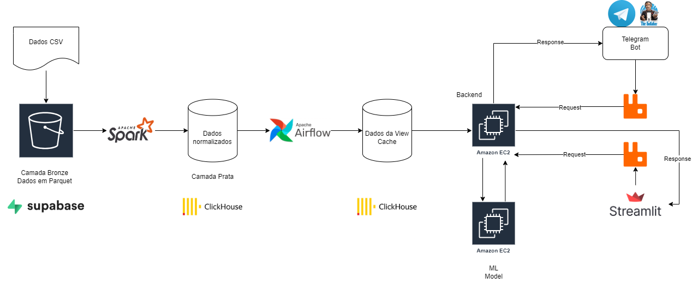

<div style="display: flex; gap: 8px; align-items: center; justify-content: flex-end">


</div>

<br>

# Template de Arquitetura de Software
Este documento posssui como finalidade registrar os detalhes acerca do âmbito arquitetural do projeto, visando facilitar seu 
entendimento e desenvolvimento.

## Sumário
- [Template de Arquitetura de Software](#template-de-arquitetura-de-software)
  - [Sumário](#sumário)
  - [Introdução](#introducao)
  - [Requisitos](#requisitos)
    - [Requisitos Funcionais](#requisitos-funcionais)
    - [Requisitos Não Funcionais](#requisitos-não-funcionais)
    - [User Stories](#user-stories)
  - [Arquitetura](#arquitetura)
    - [Visão Geral](#visão-geral)
    - [Componentes](#componentes)
    - [Arquitetura de Fluxo e Processos](#arquitetura-de-fluxo-e-processos)
    - [Modelagem dos Dados](#modelagem-dos-dados)
  - [Padrões de Design](#padrões-de-design)
  - [Escolhas Tecnológicas](#escolhas-tecnológicas)
  - [Integração de Sistemas](#integração-de-sistemas)
  - [Segurança](#segurança)
    - [Considerações de Governança - Segurança](#considerações-de-governança---segurança)
  - [Escalabilidade](#escalabilidade)
  - [Adaptabilidade](#adaptabilidade)
  - [Monitoramento e Gerenciamento](#monitoramento-e-gerenciamento)
  - [Integridade de Dados](#integridade-de-dados)
  - [Governança, Compliance e LGPD](#governança-compliance-e-LGPD)
  - [Governança da implementação](#governança-da-implementação)
  - [Ferramentas de Arquitetura](#ferramentas-de-arquitetura)
    - [Referências de arquitetura](#referências-de-arquitetura)
  - [Anexos](#anexos)
  
  
<details id="introducao" open>

<summary style="font-size: 20px">
Introdução
</summary>
O projeto visa resolver um dos principais desafios enfrentados pela CosmeticCo: a falta de comunicação eficaz entre o setor corporativo e as lojas, especialmente no que se refere aos complexos modelos de remuneração variável. Essa falta de clareza tem levado a um elevado índice de turnover, baixo engajamento dos vendedores e desempenho aquém do esperado.

</details>

<br>

<details id="requisitos" open>

<summary style="font-size: 20px">
Requisitos
</summary>

### Requisitos Funcionais
- **RF01:** O sistema deve permitir a ingestão de dados em formato CSV no S3.
- **RF02:** O sistema deve processar os dados utilizando Apache Spark para normalização.
- **RF03:** O sistema deve armazenar os dados normalizados no ClickHouse.
- **RF04:** O sistema deve permitir a interação dos usuários via bot do Telegram e interface web (Streamlit).

### Requisitos Não Funcionais
- **RNF01:** O sistema deve ser escalável para suportar o aumento do volume de dados.
- **RNF02:** O sistema deve garantir a segurança dos dados em trânsito e em repouso.
- **RNF03:** O sistema deve suportar governança de dados, permitindo controle de acesso e auditoria.

### User Stories
#### Para Gerentes:

1. **User Story: Monitoramento de Metas**
   - Como gerente de uma loja da CompanyCo, eu desejo receber relatórios diários que mostrem o progresso das metas de vendas de cada vendedor, para acompanhar o desempenho da equipe em tempo real e ajustar as estratégias de vendas conforme necessário.

2. **User Story: Gestão de Estoque Proativo**
   - Como gerente de uma loja da CompanyCo, eu desejo receber previsões de estoque com base nas vendas anteriores e nas tendências de demanda, para evitar rupturas de estoque e garantir que os produtos mais vendidos estejam sempre disponíveis.

3. **User Story: Avaliação Comparativa de Lojas**
   - Como gerente de uma loja da CompanyCo, eu quero comparar o desempenho da minha loja com outras lojas da rede em termos de vendas e satisfação do cliente, para identificar áreas de melhoria e aplicar as melhores práticas.

4. **User Story: Planejamento de Recursos Humanos**
   - Como gerente de uma loja da CompanyCo, eu quero receber recomendações de alocação de vendedores durante os horários de pico de vendas, para otimizar a cobertura da equipe e maximizar as vendas durante os períodos de maior movimento.

#### Para Vendedores:

1. **User Story: Feedback Imediato de Desempenho**
   - Como vendedor da CompanyCo, eu quero receber feedback em tempo real sobre minhas vendas diárias e progresso em relação às metas, para ajustar minha abordagem e melhorar meu desempenho.

2. **User Story: Recomendações de Produtos Complementares**
   - Como vendedor da CompanyCo, eu quero receber sugestões automáticas de produtos complementares para oferecer aos clientes, para aumentar as vendas cruzadas e melhorar a satisfação do cliente.

3. **User Story: Visualização de Comissões**
   - Como vendedor da CompanyCo, eu quero visualizar minha comissão acumulada em tempo real com base nas vendas realizadas, para ter clareza sobre meus ganhos e motivação para atingir minhas metas.

4. **User Story: Notificações de Promoções Relevantes**
   - Como vendedor da CompanyCo, eu quero receber notificações sobre promoções atuais e relevantes para os produtos que estou vendendo, para informar os clientes e aumentar a conversão de vendas.

5. **User Story: Informações sobre Produtos de Maior Margem**
   - Como vendedor da CompanyCo, eu quero ter acesso a uma lista com os produtos de maior margem percentual, com o objetivo de aumentar minhas vendas desses produtos e aumentar minha bonificação.


</details>

<br>

<details id="arquitetura" open>

<summary style="font-size: 20px">
Arquitetura
</summary>

<br>

#### Versão 1


#### Versão 2


#### Versão 3
.png)

### Visão Geral
Descrição da estrutura geral do sistema.

### Componentes
Descrição dos principais componentes e suas interações.


### Arquitetura de Fluxo e Processos


 - S3 Bucket: Arquivo em parquet com os dados extraídos do csv disponibilizado pelo parceiro.

 - Spark: Pega os dados em parquet, normaliza para o formato de dados que desejamos salvar na tabela.

 - Amazon Redshift: Onde armazenamos os dados normalizados pelo Spark.

  - Views: Export dos dados relevantes para análise de negócios, isso ficará disponível no próprio Redshift através de queries previamente criadas.

  - ML Model: Pega o que fica disponível nas views (em cache), para realizar análises proveitosas para o negócio.

  - Backend Application: Pega análises do modelo, além disso é responsável por organizar toda parte de gerenciamento do telegram, usuário e segurança da aplicação.

  - Telegram bot: Responsável pela interação com o vendedor, facilitando o uso em qualquer lugar. 


### Modelagem dos Dados

1. Modelagem dos dados da view 'vw_margem_lucro_produtos_mensal':

Essa view tem o objetivo de fornecer os dados da margem de lucro dos produtos. 

``` 
  CREATE VIEW IF NOT EXISTS default.vw_margem_lucro_produtos_mensal AS
  SELECT
      d.cod_prod,
      d.nome_abrev,
      d.nome_completo,
      d.categoria,
      d.sub_categoria,
      d.marca,
      formatDateTime(p.data_inicio, '%Y-%m') AS ano_mes,
      AVG((p.preco - c.custo) / NULLIF(p.preco, 0)) * 100 AS margem_lucro_mensal
  FROM
      default.sku_price p
  INNER JOIN
      default.sku_cost c ON p.cod_produto = c.cod_prod
  INNER JOIN
      default.sku_dataset d ON c.cod_prod = d.cod_prod
  WHERE
      (p.data_fim IS NULL OR p.data_fim >= c.data_inicio)
      AND (c.data_fim IS NULL OR c.data_fim >= p.data_inicio)
  GROUP BY
      d.cod_prod, d.nome_abrev, d.nome_completo, d.categoria, d.sub_categoria, d.marca, ano_mes
  ORDER BY
      ano_mes, d.cod_prod;
```

A query calcula a margem de lucro mensal para cada produto, considerando o preço de venda e o custo, agrupando os dados por produto e mês. Ela retorna informações detalhadas sobre cada produto, incluindo categoria, subcategoria, marca, e exibe a margem de lucro como uma porcentagem. O resultado é ordenado por mês e código do produto.

Exemplo de como pode ser usada a view:

```
  SELECT *
  FROM default.vw_margem_lucro_produtos_mensal
  WHERE ano_mes = '2024-08';
```

1.1. Modelo Lógico:


1.2. Modelo Físico:


1.3. Modelo Relacional:


### Modelagem dos Dados Cumprimento de Metas de Vendas

2. Modelagem dos dados da view 'vw_cuprimento_metas_mensal_vendedor:

Essa view tem o objetivo de fornecer o cumprimento de metas de vendas. 

``` 
CREATE VIEW IF NOT EXISTS default.vw_cumprimento_metas_mensal_vendedor AS
SELECT 
    tsf.id_employee,
    tsf.month,
    tsf.sales_target,
    COALESCE(SUM(tf.preco), 0) AS total_vendido
FROM 
    targets_salesperson_final tsf
LEFT JOIN 
    transacation_fact_v6_2024 tf 
ON 
    tsf.id_employee = tf.cod_vendedor 
    AND tsf.month = formatDateTime(tf.transaction_data, '%m/%Y')
GROUP BY 
    tsf.id_employee, tsf.month, tsf.sales_target;

```

Essa query cria uma *view* que mostra, para cada vendedor e mês, as metas de vendas e o total vendido. Ela une as informações de metas de vendas com as transações reais e, se um vendedor não tiver registrado vendas em um determinado mês, o total vendido será `0`.

Exemplo de como pode ser usada a view:

```
  SELECT *
  FROM default.vw_cuprimento_metas_mensal_vendedor
  WHERE ano_mes = '2024-08';
```

2.1. Modelo Lógico:


2.2. Modelo Físico:


2.3. Modelo Relacional:


3. Modelagem dos dados da view 'cross_sell':

Essa view tem o objetivo de fornecer os dados sobre os produtos que vendem juntos.

Primeiro é criada uma view para agrupar todas as tabelas de transação:

```
CREATE VIEW IF NOT EXISTS default.vw_transaction_fact_v6_all AS
SELECT * FROM transaction_fact_v6_2018
UNION ALL
SELECT * FROM transaction_fact_v6_2019
UNION ALL
SELECT * FROM transaction_fact_v6_2020
UNION ALL
SELECT * FROM transaction_fact_v6_2021
UNION ALL
SELECT * FROM transaction_fact_v6_2022
UNION ALL
SELECT * FROM transaction_fact_v6_2023
UNION ALL
SELECT * FROM transaction_fact_v6_2024

```

Depois é feita a view do cross sell:
```
CREATE VIEW IF NOT EXISTS cross_sell AS
SELECT 
    a.cod_prod AS product_a,
    b.cod_prod AS product_b,
    COUNT(*) AS times_bought_together
FROM 
    default.vw_transaction_fact_v6_all a
JOIN
    default.vw_transaction_fact_v6_all b
ON a.cod_transacao = b.cod_transacao
WHERE a.cod_prod < b.cod_prod
GROUP BY a.cod_prod, b.cod_prod
ORDER BY times_bought_together DESC;
```
Essa query cria uma *view* que mostra, para cada produto A e produto B, quantas vezes esses produtos foram comprados juntos. Ela une as informações de todas as transações de diferentes anos e, ao comparar os produtos dentro da mesma transação, conta quantas vezes cada par de produtos foi comprado simultaneamente.

Exemplo de uso:
```

--- combinacoes mais frequentes para um produto especifico:
SELECT
    product_a,
    product_b,
    times_bought_together
FROM
    cross_sell
WHERE
    product_a = insira o codigo do produto cod_produto 
ORDER BY
    times_bought_together DESC
LIMIT 5;

----- Top 5 combinacoes mais frequentes
SELECT *
FROM cross_sell
ORDER BY times_bought_together DESC
LIMIT 1;

 
```

3.1. Modelo Lógico:


3.2. Modelo Físico:


3.3. Modelo Relacional:


[Veja os modelos detalhadamente aqui](https://app.diagrams.net/#G1XF0UlBcNcxL2f5fYI1FTflDHU80L_NP7#%7B%22pageId%22%3A%22C5RBs43oDa-KdzZeNtuy%22%7D)

</details>

<br>

<details id="padrões-de-design" open>

<summary style="font-size: 20px">
Padrões de Design
</summary>

O design da arquitetura do sistema segue uma série de padrões bem estruturados em pipelines de dados e em soluções baseadas em Machine Learning. A seguir há os principais elementos:

1. **Camada de Ingestão de Dados:**
   - O pipeline começa com a ingestão de dados brutos, que são armazenados diretamente na **Camada Bronze**, utilizando um **Data Lake** no **Amazon S3**. Esta camada armazena os dados em formato **RAW** (sem transformações), um padrão comum para garantir que os dados originais estejam sempre disponíveis.
   
2. **ETL (Extract, Transform, Load):**
   - O processo de ETL é realizado utilizando o **Apache Spark**, que é uma ferramenta de processamento distribuído amplamente usada para transformar os dados da Camada Bronze e carregá-los na **Camada Prata**, onde os dados estão limpos e prontos para serem trabalhados (working data).
   - **Padrão:** Esse estágio segue o padrão de **ETL distribuído**, no qual grandes volumes de dados são processados de forma eficiente.

3. **Camada Prata:**
   - Nessa camada, os dados transformados e limpos são armazenados no **Amazon Redshift**, um banco de dados voltado para **data warehousing**.
   - **Padrão:** Aqui existe o **padrão de banco de dados analítico**, otimizado para consultas rápidas e em larga escala.

4. **Procedures e Camada Ouro:**
   - **Procedures** são aplicadas sobre os dados da Camada Prata, preparando-os para a **Camada Ouro**, onde são criadas **views trusted**, ou seja, visualizações confiáveis e prontas para consumo por outros serviços, especialmente o modelo de Machine Learning.
   - **Padrão:** Este design é baseado no **padrão de camadas de dados** (Bronze, Prata e Ouro), onde os dados se tornam progressivamente mais refinados e utilizáveis em diferentes estágios do pipeline.

5. **Modelo:**
   - Os dados da Camada Ouro são  executados em instâncias **EC2 da AWS**.
   - **Padrão:** Aqui é utilizado o **padrão de treinamento de modelo em ambiente escalável**, com o uso de instâncias EC2 para computação flexível e escalável.

6. **Backend e Integração:**
   - O Backend, também rodando em instâncias **EC2**, comunica-se com o modelo de Machine Learning para receber previsões e outros outputs.
   - A arquitetura utiliza **RabbitMQ**, um sistema de mensageria que promove a comunicação assíncrona entre diferentes partes do sistema (ex: modelo de ML, backend, interface com o usuário).
   - **Padrão:** Esse é um exemplo do **padrão de comunicação assíncrona e desacoplada**, onde serviços independentes trocam mensagens sem necessidade de conexão direta.

7. **Front-end (Streamlit e Telegram Chatbot):**
   - O sistema se integra a uma interface **Streamlit**, utilizada para a visualização dos resultados de forma interativa, e a um **chatbot do Telegram** para comunicação com os usuários.
   - **Padrão:** **Integração com sistemas de visualização e comunicação** para fornecer uma interface acessível aos usuários finais.

A arquitetura combina o padrão de camadas de dados (Bronze, Prata, Ouro) com componentes escaláveis (EC2, Apache Spark), mensageria assíncrona (RabbitMQ) e interfaces de fácil acesso (Streamlit, Telegram).

</details>

<br>

<details id="escolhas-tecnológicas" open>

<summary style="font-size: 20px">
Escolhas Tecnológicas
</summary>

- **Amazon S3** é escolhido por sua durabilidade, alta disponibilidade e excelente integração com outros serviços AWS, sendo ideal para armazenar grandes volumes de dados não estruturados. 
- **Apache Spark** é utilizado para o processamento de grandes conjuntos de dados de forma distribuída e rápida, suportando tanto batch quanto processamento em tempo real. 
- **Apache Airflow** é selecionado para orquestrar complexos workflows de processamento de dados, permitindo uma automação robusta e flexível dos pipelines de dados. 
- **ClickHouse** é um banco de dados colunar que oferece desempenho extremamente rápido em operações de leitura, ideal para análises em tempo real e big data. 
- **AWS EC2** fornece capacidade computacional redimensionável na nuvem, permitindo ajustar a infraestrutura rapidamente para atender às demandas variáveis de carga. 
- **Frontend:**

    **Streamlit** é usado para criar aplicativos de dados interativos de maneira rápida e com pouco overhead, enquanto o **Telegram Bot** facilita a interação em tempo real com usuários finais ou sistemas externos, demonstrando a flexibilidade e a capacidade de integrar com plataformas de comunicação populares.


</details>

<br>

<details id="integração-de-sistemas" open>

<summary style="font-size: 20px">
Integração de Sistemas

</summary>

A estrutura geral do sistema começa com a ingestão de dados em formato CSV que são carregados no Amazon S3. Este repositório de dados serve como um ponto de entrada, armazenando os dados brutos antes de serem processados. A partir do S3, um componente Listener detecta novos dados e os transmite para um processo de transformação e normalização usando Apache Spark, que está configurado para converter os dados em um formato mais otimizado (Parquet) e realizar a limpeza e normalização necessárias.

Após o processamento inicial, os dados são movidos para uma camada de armazenamento intermediária, onde são organizados em camadas denominadas de Bronze (dados brutos em formato Parquet), Prata (dados normalizados) e Ouro (dados agregados prontos para consulta), facilitando a separação entre armazenamento de dados brutos, dados processados e dados prontos para análise e visualização. Apache Airflow é utilizado para orquestrar e automatizar todo o fluxo de dados, assegurando que cada etapa seja concluída de forma eficaz e eficiente.
bora isso na visao geral
</details>

<br>

<details id="segurança" open>

<summary style="font-size: 20px">
Segurança
</summary>

* **Autenticação Multifator (MFA):** Implementação de autenticação em dois fatores para garantir que apenas usuários autorizados possam acessar o sistema.
  
* **Criptografia de Dados:** Todos os dados sensíveis, tanto em repouso quanto em trânsito, são criptografados usando protocolos de segurança.

* **Controle de Acesso Baseado em Funções (RBAC):** Definição de permissões específicas de acordo com o perfil de cada usuário (vendedores e gerentes), garantindo que cada pessoa tenha acesso apenas às informações e funções necessárias.

* **Monitoramento e Auditoria Contínuos:** Logs detalhados de acessos, modificações e atividades no sistema, com alertas automáticos para detectar possíveis violações de segurança.

* **Backup e Recuperação de Dados:** Procedimentos robustos para garantir que os dados possam ser recuperados em caso de falhas no sistema ou ataques cibernéticos.

* **Prevenção de Ameaças e Vulnerabilidades:** Uso de firewalls, antivírus, ferramentas de detecção de intrusão e escaneamento contínuo de vulnerabilidades.

* **Treinamento de Segurança para Usuários:** Treinamentos regulares para educar a equipe sobre práticas seguras de uso do sistema, identificação de possíveis ameaças e como proceder em caso de incidentes.

### Considerações de Governança - Segurança
* **Gerenciamento de Riscos de Segurança:** Avaliação contínua dos riscos e vulnerabilidades que o sistema pode enfrentar, com planos de mitigação para cada cenário identificado.

* **Conformidade com Leis e Regulamentações:** Adoção de medidas para garantir conformidade com a LGPD (Lei Geral de Proteção de Dados) e outras regulamentações locais e internacionais aplicáveis, como GDPR.

* **Auditorias Regulares:** Revisões periódicas de segurança conduzidas por terceiros para garantir a eficácia das medidas de proteção e a conformidade com padrões de mercado.

* **Política de Acesso a Dados Sensíveis:** Definição de regras claras para o acesso, manipulação e armazenamento de dados sensíveis, garantindo que o uso seja restrito e controlado.

* **Governança de Incidentes de Segurança:** Definição de um plano de resposta a incidentes, com equipes designadas para atuar imediatamente em casos de violações de segurança e comunicação clara com as partes interessadas.

Mais medidas de segurança podem ser encontradas na arquitetura de dados  a seguir: 
[Arquitetura de Dados](arquitetura_de_dados.md)


</details>

<br>

<details id="escalabilidade" open>

<summary style="font-size: 20px">
Escalabilidade
</summary>

Para garantir a escalabilidade, a arquitetura aproveita a elasticidade dos recursos da AWS, como EC2, que ajustam automaticamente os recursos computacionais com base na demanda. O uso de bancos de dados distribuídos, como o ClickHouse, otimizado para consultas rápidas em grandes volumes de dados, permite a escalabilidade horizontal eficaz. O design desacoplado da arquitetura facilita que os componentes escalem independentemente, melhorando a gestão de recursos e a manutenção.


</details>

<br>

<details id="adaptabilidade" open>

<summary style="font-size: 20px">
Adaptabilidade
</summary>

A arquitetura tem uma estratégia modular que facilita a adaptabilidade, permitindo que componentes sejam atualizados ou substituídos independentemente conforme necessário. Isso é complementado pelo uso de microserviços, que encapsulam funcionalidades específicas e permitem que novas funcionalidades sejam integradas ou modificadas sem afetar outras partes do sistema. O uso de Apache Airflow para automação e orquestração de workflows garante que ajustes e integrações de novos componentes ou fontes de dados sejam facilitados, enquanto APIs claras e bem documentadas reduzem o acoplamento entre módulos.

</details>

<br>

<details id="monitoramento-e-gerenciamento" open>

<summary style="font-size: 20px">
Monitoramento e Gerenciamento
</summary>

A arquitetura é composta por diversas camadas, desde o armazenamento de dados até a interação final com os usuários, e cada uma delas requer atenção específica. A seguir, são detalhados os pontos de monitoramento identificados, considerações estratégicas e a proposta de monitoramento detalhada.

**1. Pontos de Monitoramento e Gerenciamento Identificados na Arquitetura:**

- **S3 Bucket:** A monitoração do bucket S3 é crucial para garantir que os arquivos CSV sejam carregados corretamente e convertidos para o formato parquet. Devemos monitorar eventos de upload e download, além de verificar a integridade dos dados e acessos não autorizados através dos logs de acesso e uso.

- **Spark:** O Spark é responsável por normalizar os dados antes de serem armazenados no Redshift. É essencial monitorar o desempenho das tarefas, tempo de execução e o uso de recursos. Alertas devem ser configurados para falhas nos jobs ou degradação de performance, para que ações corretivas possam ser tomadas rapidamente.

- **Amazon Redshift:** Como principal base de armazenamento dos dados tratados, o Redshift deve ser monitorado em termos de performance de consultas, uso de espaço em disco e contagem de conexões. É importante acompanhar a carga de dados e o sucesso ou falha dos processos ETL para garantir a consistência dos dados.

- **Views no Redshift:** As views são essenciais para disponibilizar dados relevantes para as análises de negócios. Devemos monitorar o tempo de execução das consultas para garantir que os dados sejam disponibilizados de forma rápida e eficiente. Acompanhamento dos padrões de acesso também é necessário para otimizar as views para as consultas mais frequentes.

- **Modelo de Machine Learning:** O modelo de ML realiza análises com base nas views, e sua performance deve ser constantemente monitorada. Métricas como acurácia, desvio e tempo de resposta são fundamentais para garantir que as análises sejam úteis e precisas. Além disso, é importante registrar as previsões e erros do modelo para ajustes contínuos.

- **Aplicação Backend:** O backend gerencia as análises do modelo e a integração com o Telegram. A performance da API, tempos de requisição/resposta e taxas de erro devem ser monitorados. A segurança da aplicação, incluindo padrões de autenticação e acesso, também é crucial para proteger os dados e usuários.

- **Bot no Telegram:** O bot é o ponto de interação com os vendedores e deve ter seu desempenho monitorado para garantir que as mensagens sejam entregues corretamente e em tempo hábil. Alertas devem ser configurados para identificar problemas de conectividade ou desempenho que possam afetar a experiência do usuário.

**2. Considerações Estratégicas:**

- **Privacidade e Segurança dos Dados:** O monitoramento deve assegurar que todos os dados sejam tratados de acordo com as normas de segurança, especialmente dados sensíveis do negócio. Logs de acesso e auditoria são fundamentais para identificar e responder a acessos não autorizados.

- **Escalabilidade:** O sistema precisa ser escalável para suportar aumentos de carga à medida que mais dados e usuários interagem com a plataforma. Monitorar os pontos críticos ajuda a identificar gargalos e possibilita o ajuste proativo de recursos.

- **Gestão de Custos:** Com o uso de serviços na nuvem, o controle de custos é uma prioridade. O monitoramento do uso de recursos ajuda a otimizar a alocação e evitar desperdícios, especialmente em serviços como Redshift e Spark.

- **Experiência do Usuário:** A rápida identificação de problemas que afetem o tempo de resposta do dashboard e do bot é essencial para manter uma boa experiência dos gerentes e vendedores.

**3. Proposta Detalhada de Monitoramento e Gerenciamento:**

- **AWS CloudWatch:** Utilizar o CloudWatch para monitorar e registrar eventos dos serviços S3, Spark, Redshift e da aplicação backend. Alarmes devem ser configurados para métricas críticas, como taxas de erro, lentidão nas execuções dos jobs e uso excessivo de recursos.

- **Monitoramento de Performance do Amazon Redshift:** Utilizar as ferramentas de monitoramento nativas do Redshift e consultas SQL para acompanhar o desempenho, uso de espaço e filas de gerenciamento de carga de trabalho.

- **Grafana:** Configurar o Grafana para visualização em tempo real da saúde e desempenho do sistema.

- **AWS Lambda para Respostas Automatizadas:** Utilizar funções Lambda acionadas por eventos do CloudWatch para respostas automáticas, como reinicialização de jobs Spark que falharem ou ajustes automáticos nos clusters do Redshift.


**4. Monitoramento e gerenciamento de códigos:**

O pipeline é acionado nas seguintes situações:

- Quando um push é feito nos branches `develop` ou `main`.
- Quando um pull request é aberto, atualizado ou fechado nos branches `develop` ou `main`.

Ambiente de Execução:

- O pipeline é executado em um ambiente Ubuntu mais recente (ubuntu-latest).

Etapas do Pipeline: 

- A primeira etapa faz o checkout do código-fonte do repositório, permitindo que o pipeline tenha acesso ao código mais recente.
- A segunda etapa configura o Docker Buildx, que é necessário para construir e executar os containers Docker.
- A terceira etapa executa o comando docker compose para construir e iniciar os containers Docker definidos no arquivo docker-compose.yml localizado em Application/etl.
- A quarta etapa acessa o diretório Application/backend e instala todas as dependências do projeto Node.js usando o comando npm install.
- A quinta etapa inicia o backend Node.js no diretório Application/backend usando npm start e define a variável de ambiente BOT_TOKEN.
- A sexta etapa executa o comando docker compose down para parar e remover os containers Docker que foram iniciados anteriormente.

Variáveis de Ambiente:

- BOT_TOKEN: Variável passada durante a execução do backend Node.js, recuperada dos segredos configurados no repositório do GitHub.

**Esteira de CI no Github Actions:**
 </img>

</details>


<br>

<details id="governança-compliance-e-lgpd" open>

<summary style="font-size: 20px">
Governança, Compliance e LGPD
</summary>

- **Auditoria:** Log de atividades para auditoria completa do sistema, garantindo rastreabilidade das ações dos usuários.

- **Política de Acesso:** Implementação de controle de acesso baseado em funções (RBAC) para restringir o acesso aos dados sensíveis.
- **Fluxos de Aprovação:** Definição de processos de aprovação para alterações críticas na infraestrutura de dados.


### Conformidade com a LGPD (Lei Geral de Proteção de Dados)

A conformidade com a LGPD é essencial para proteger os dados pessoais dos gerentes e colaboradores e garantir que as operações da CosmeticCo estejam em conformidade com as exigências legais. A seguir, é detalhado as principais medidas implementadas e necessárias para assegurar essa conformidade:

1. **Base Legal para o Tratamento de Dados**:  
   Antes de realizar qualquer tratamento de dados, é identificada e registrada a base legal apropriada para cada operação (como consentimento, cumprimento de obrigação legal, execução de contrato, entre outros), conforme estipulado na LGPD.

2. **Consentimento Informado**:  
   Sempre que aplicável, é obtido consentimento explícito dos titulares dos dados, com informações claras sobre como seus dados serão utilizados nas operações da CosmeticCo, com quem serão compartilhados e quais são seus direitos. Os titulares têm a opção de revogar o consentimento a qualquer momento.

3. **Direitos dos Titulares de Dados**:  
   A arquitetura inclui mecanismos que permitem que os titulares de dados exerçam seus direitos previstos na LGPD, como correção, exclusão e objeção ao tratamento de seus dados. A ferramenta, Assistente de Vendas Hiper Personalizado, oferece interfaces intuitivas para gerentes e vendedores controlarem e acessarem seus próprios dados de forma segura e ágil.

4. **Minimização de Dados**:  
   Apenas os dados estritamente necessários para o cumprimento dos objetivos de negócio são coletados e tratados. A coleta e o uso de dados pessoais são revisados regularmente para garantir que não haja excessos ou informações desnecessárias armazenadas.

5. **Anonimização e Pseudonimização dos Dados**:  
   Sempre que possível, os dados pessoais são anonimizados ou pseudonimizados para reduzir os riscos à privacidade dos titulares, especialmente em casos de análises e relatórios que não exijam a identificação direta das pessoas.

6. **Relatório de Impacto à Proteção de Dados (RIPD)**:  
   Para qualquer operação de tratamento que possa representar riscos elevados aos direitos e liberdades dos titulares, é realizado um Relatório de Impacto à Proteção de Dados que pode ser feito, conforme exigido pela LGPD. Esse relatório identifica e avalia os riscos, além de propor medidas para mitigá-los.

7. **Armazenamento e Retenção de Dados**:  
   Políticas claras de retenção de dados são estabelecidas, assegurando que os dados pessoais sejam armazenados apenas pelo tempo necessário para cumprir a finalidade do tratamento, conforme os requisitos legais e regulamentares.

8. **Transferência Internacional de Dados**:  
   Em casos onde os dados pessoais forem transferidos para fora do Brasil em outras operações da CosmeticCo, são adotadas conjunto de medidas  adequadas para garantir que os dados permaneçam protegidos, em conformidade com a LGPD. Essas medidas incluem cláusulas contratuais específicas ou a verificação de que o país destinatário possui um nível adequado de proteção de dados.

9. **Encarregado de Proteção de Dados (DPO)**:  
   A organização deve contar com um Encarregado de Proteção de Dados (DPO), responsável por garantir o cumprimento da LGPD, atuar como ponto de contato para os titulares de dados e cooperar com a Autoridade Nacional de Proteção de Dados (ANPD).

10. **Treinamentos e Conscientização**:  
    É necessária a realização de  treinamentos regulares para colaboradores sobre as diretrizes da LGPD, boas práticas de proteção de dados e a importância de seguir as políticas de privacidade e segurança estabelecidas pela empresa. Isso contribui para a criação de uma cultura organizacional centrada na proteção de dados.

Com essa abordagem, garantimos  a proteção dos dados pessoais dos envolvidos, evitando sanções e fortalecendo a confiança dos gerentes e colaboradores na gestão das informações.


</details>

<br>

<details id="governança-da-implementação" open>

<summary style="font-size: 20px">
Governança da implementação
</summary>

A gestão de mudanças na arquitetura seguirá um fluxo estruturado para garantir que as alterações sejam planejadas, aprovadas e implementadas de maneira eficiente, minimizando riscos. Nesse Contexto, podemos listar algumas etapas:

1. **Identificação da Necessidade de Mudança:**  
   As demandas podem surgir de diferentes fontes, como requisitos de negócio, novos padrões tecnológicos, ou problemas identificados na arquitetura atual. 

2. **Avaliação de Impacto e Planejamento:**  
   Antes de qualquer implementação, uma análise completa do impacto da mudança será realizada, levando em consideração aspectos como desempenho, segurança, escalabilidade e custos. 

3. **Aprovação e Comunicação:**  
   Uma vez definido o plano, ele será submetido para aprovação das partes interessadas, incluindo a liderança técnica e de negócios. Após a aprovação, as mudanças serão comunicadas a todos os stakeholders relevantes, garantindo alinhamento e compreensão dos impactos.

Essa estrutura permite uma governança clara e eficiente, promovendo uma arquitetura de alta qualidade e um processo de mudança controlado.         

</details>

<br>

<details id="ferramentas-de-arquitetura" open>

<summary style="font-size: 20px">
Ferramentas de Arquitetura
</summary>


 - Para construir a arquitetura utilizamos o Draw.io, pois possui figuras que auxiliam a ilustrar o fluxo de forma eficiente.

 - Além disso, utilizamos um package de AWS para ilustrar exatamente quais são os serviços que serão utilizados, o que seria difícil com o recurso default do Draw.io.

### Referências de arquitetura
- **TOGAF (The Open Group Architecture Framework)**

[Acesso ao TOGAF](https://www.leanix.net/en/wiki/ea/togaf?utm_term=togaf%20architecture&utm_source=adwords&utm_medium=ppc&utm_campaign=LATIN-AMERICA-BRAZIL_TOGAF_AO_Search_ENG&hsa_ver=3&hsa_cam=21076153865&hsa_grp=164825689812&hsa_acc=2468165327&hsa_kw=togaf%20architecture&hsa_mt=e&hsa_net=adwords&hsa_src=g&hsa_tgt=kwd-10090642913&hsa_ad=692760508724&gad_source=1&gclid=CjwKCAjwxY-3BhAuEiwAu7Y6s0Wpk8ssMpRZ2gYzACAl8rNa48qkUNZ9L42J0kNbzfmK__ves8SSjRoCQWsQAvD_BwE)
- **IEEE Standard 1471-2000: Recommended Practice for Architectural Description of Software-Intensive Systems**

[Acesso ao IEEE Standard 1471-2000](https://standards.ieee.org/ieee/1471/2187/)
</details>

<br>

<details id="anexos" open>

<summary style="font-size: 20px">
Anexos
</summary>

</details>


